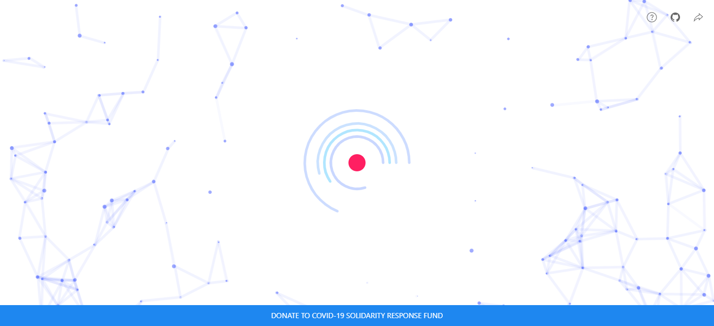

# Avirio

A COVID-19 relief website powered by the JSEcoin block chain where all profits are donated to the World Health Organization's COVID-19 Solidarity Response Fund. You can visit the website [here](https://iandraves.github.io/Avirio).

## More Info

Avirio is an open-source project aimed at leveraging a small portion of your computer's resources to make a big difference in relief efforts for the novel coronavirus. Thanks to the efficiency of the JSEcoin block chain, it is possible to do effective web-based crypto-mining. This means that by simply letting Avirio run in your browser you are donating to COVID-19 research & relief because 100% of profits are donated to the World Health Organization's COVID-19 Solidarity Response Fund.

## Page

## Contributing
Pull requests are welcome. For major changes, please open an issue first to discuss what you would like to change.

Thank you for contributing!

## License
[Apacha-2.0](https://choosealicense.com/licenses/apache-2.0/)